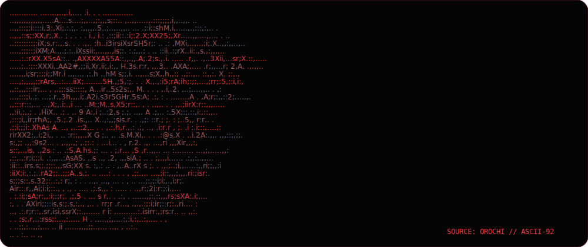

## `// OPERATOR`

> **Software Engineer** from **Your location**  
> Forging resilient systems in the dark.

I build deliberate, reliable software where product thinking meets engineering discipline. This profile is a living signal: generated assets, activity visualizations, and a small automation system that keeps itself current.

  

## `// ARSENAL`

  

## `// TELEMETRY`

  <picture>
    <source media="(prefers-color-scheme: dark)" srcset="https://github-readme-stats.vercel.app/api?username=YOUR_GITHUB_USERNAME&show_icons=true&hide_border=true&bg_color=050505&title_color=ff3344&icon_color=ff3344&text_color=bdbdbd&ring_color=ff3344" />
    
  </picture>
  

## `// CONTRIBUTION TRACE`

  <picture>
    <source media="(prefers-color-scheme: dark)" srcset="https://raw.githubusercontent.com/YOUR_GITHUB_USERNAME/YOUR_GITHUB_USERNAME/output/github-contribution-grid-snake-dark.svg" />
    <source media="(prefers-color-scheme: light)" srcset="https://raw.githubusercontent.com/YOUR_GITHUB_USERNAME/YOUR_GITHUB_USERNAME/output/github-contribution-grid-snake.svg" />
    
  </picture>

`SIGNAL ENDS // SYSTEM CONTINUES`

[Back to top](#)

<!-- PROFILE_USERNAME:YOUR_GITHUB_USERNAME -->

